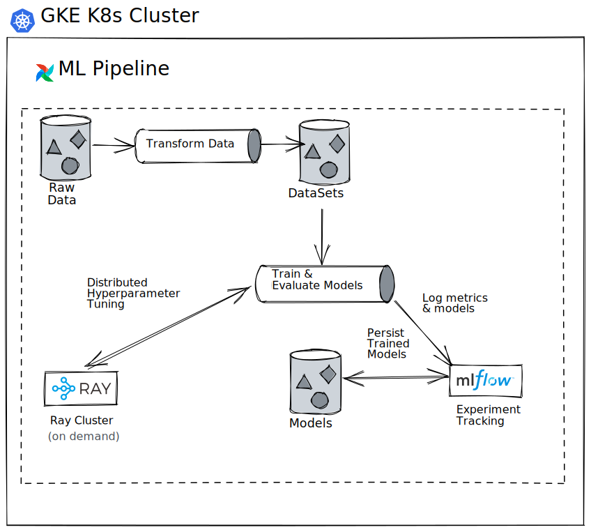

# Sortin-hat
Sortin-hat was a Machine Learning (ML) platform for training ML models to predict secondary school scores. The resulting predictions would serve as personalised goal setting for the students.

## Features
- **Scalable** Model training & hyperparameter tuning is performed on a distributed Ray cluster.
- **Pluggable**  ML models are swappable to facilitate model selection. Models trained on the platform need only to implement a standardise `Model` interface.
- **Reliable**
    - ML Pipeline its built on Apache Airflow with built in retries to overcome transient failures.
    - Data processing within the Pipeline transparently handles missing values.
- **Cloud Native**  Sortin-hat is designed to run on Kubernetes, leverage cheap object storage to store its models & data.

## Architecture

- **ML Pipeline**  End to End Airflow DAG to train models from raw spreadsheet data.
- **Apache Airflow** Workflow Orchestrator which schedules  & runs the ML Pipeline.
- **MLflow** MLFlow is used to track model & hyperparameter experiments into later analysis.
- **Google Cloud Storage (GCS)** GCS buckets are used to store staging data & trained models.

## License
MIT.
